# ⚡ AgentCommerce Layer
### Autonomous Policy-Gated Agentic Commerce Infrastructure on Razorpay Payment Rails
**Razorpay Buildathon — Track 01: AI Growth & Agentic Commerce**

---

## 📑 Table of Contents
1. [Executive Summary & The Big Picture](#-1-executive-summary--the-big-picture)
2. [The Core Problem & Real-World Impact](#-2-the-core-problem--real-world-impact)
   - [Why Traditional E-Commerce Breaks for AI Buyers](#why-traditional-e-commerce-breaks-for-ai-buyers)
   - [The Role AgentCommerce Layer Plays](#the-role-agentcommerce-layer-plays)
   - [Impact on Key Stakeholders (Merchants, Shoppers, Razorpay)](#impact-on-key-stakeholders)
3. [System Architecture: The 7-Layer Tree Model](#-3-system-architecture-the-7-layer-tree-model)
4. [Inception-to-Present Implementation Journey](#-4-inception-to-present-implementation-journey)
   - [Phase 1: Knowledge & Vector Database Foundations](#phase-1-knowledge--vector-database-foundations)
   - [Phase 2: Typed Tool Schemas & LangGraph ReAct Agent Loop](#phase-2-typed-tool-schemas--langgraph-react-agent-loop)
   - [Phase 3: Cart Orchestration & Razorpay Test Rails](#phase-3-cart-orchestration--razorpay-test-rails)
   - [Phase 4: Trust & Policy Enforcement Engine](#phase-4-trust--policy-enforcement-engine)
   - [Phase 5: Open Interoperability Protocol (ACP / AP2 / UAP)](#phase-5-open-interoperability-protocol-acp--ap2--uap)
   - [Phase 6: High-Fidelity Buyer UI & Streamlit Control Plane](#phase-6-high-fidelity-buyer-ui--streamlit-control-plane)
5. [Deep Dive into Core Technical Modules](#-5-deep-dive-into-core-technical-modules)
   - [A. Machine-to-Machine Interoperability Contract](#a-machine-to-machine-interoperability-contract)
   - [B. Bounded Trust & Guardrail Verification Engine](#b-bounded-trust--guardrail-verification-engine)
   - [C. Explainable Immutable Audit Logging](#c-explainable-immutable-audit-logging)
   - [D. Conversational ReAct Loop with Gemini](#d-conversational-react-loop-with-gemini)
6. [Live Verification & Automated Testing](#-6-live-verification--automated-testing)
7. [Competitive Differentiators (Why This Stands Out)](#-7-competitive-differentiators-why-this-stands-out)
8. [Strategic Roadmap & Next-Level Enhancements](#-8-strategic-roadmap--next-level-enhancements)
9. [Project Execution & Setup Playbook](#-9-project-execution--setup-playbook)

---

## 🌟 1. Executive Summary & The Big Picture

The global commerce landscape is transitioning from **Human-Driven Click Commerce** (browsing static web pages, manual filters, checkout buttons) to **Agentic Commerce** (autonomous AI buying agents searching, evaluating specifications, negotiating, and transacting on behalf of users).

Payment networks worldwide—including **NPCI (Unified Agent Protocol / UAP)**, global consortiums (**Agentic Commerce Protocol / ACP**, **Agent Payments Protocol / AP2**), and leading fintech innovators like **Razorpay**—are actively building the rails for this transition. However, a critical gap exists:

> **How can an existing Razorpay merchant make their catalog and checkout pipeline immediately discoverable, readable, and transactable by external AI buying agents safely—without suffering inventory draining, bot hoarding, or unauthorized charge exploitation?**

**⚡ AgentCommerce Layer** is an end-to-end, policy-gated infrastructure that solves this exact challenge. It exposes a standardized discovery manifest (`/.well-known/agent-commerce.json`), offers semantic vector catalog search via **ChromaDB**, operates a conversational ReAct reasoning agent powered by **Google Gemini**, enforces strict **Trust & Policy Guardrails**, logs immutable audit trails, and executes orders directly on **Razorpay test-mode payment rails**.

```
                           +-------------------------------------+
                           |      Autonomous AI Buyer Agent      |
                           |       (or Human Chat Shopper)       |
                           +------------------+------------------+
                                              | (ACP / AP2 REST)
                                              v
+-----------------------------------------------------------------------------------+
|                            AGENTCOMMERCE GATEWAY LAYER                            |
|                                                                                   |
|  [ Discovery Manifest ]  --> [ Semantic Vector Search ]  --> [ LangGraph ReAct ]  |
|  /.well-known/agent.json         ChromaDB + MiniLM             Gemini Reasoning   |
|                                                                      |            |
|                                                                      v            |
|  [ Immutable Audit Log ] <-- [ Trust & Policy Gate ]    <-- [ Cart Orchestration ]|
|    JSON/CSV Grounding          Max Value / Rate / Qty          State Management   |
+--------------------------------------|--------------------------------------------+
                                       v
                     +-----------------------------------+
                     |      Razorpay Test Mode APIs      |
                     |  (Order Creation & Test Checkout) |
                     +-----------------------------------+
```

---

## 🎯 2. The Core Problem & Real-World Impact

### Why Traditional E-Commerce Breaks for AI Buyers
1. **Unstructured DOM Scraping:** Modern websites rely on complex JavaScript DOM trees, popups, and captchas. AI agents trying to buy products break when CSS class names change.
2. **Lack of Programmatic Intent Handshake:** There is no standard way for an agent to say *"Find me waterproof running shoes under ₹3000, verify stock, and buy 1 pair"*.
3. **Severe Security & Bot Vulnerabilities:** If an API endpoint is opened for machines, malicious bots can hoard inventory, launch denial-of-inventory attacks, or execute runaway micro-transactions.
4. **Zero Explainability / Auditability:** When an autonomous transaction occurs, merchants currently have no visibility into *why* an agent made a purchasing decision or if a guardrail blocked a fraudulent attempt.

### The Role AgentCommerce Layer Plays
AgentCommerce Layer acts as the **Intelligent Protocol Adapter and Security Perimeter** between the open AI ecosystem and the merchant’s Razorpay account:
- **For AI Agents:** Provides an unambiguous, self-describing tool interface with machine-readable discovery.
- **For Merchants:** Gives total sovereignty through customizable trust policies (max cart caps, unit caps, velocity rate-limits) and transparent audit analytics.
- **For Humans:** Offers a conversational shopping widget that turns natural language intent into verified carts and Razorpay checkout links.

### Impact on Key Stakeholders

| Stakeholder | Before AgentCommerce Layer | With AgentCommerce Layer |
| :--- | :--- | :--- |
| **Razorpay Merchants** | Inaccessible to AI search engines and personal shopping assistants; vulnerable to automated scraping. | Instantly discoverable by AI buyers; revenue expands into machine-to-machine commerce with 0 bot hoarding risk. |
| **Consumers / AI Users** | Must manually browse dozens of pages, compare specs, and click through 5 checkout steps. | Instructs their personal AI agent to find and buy the exact item; purchase completes autonomously in < 4 seconds. |
| **Razorpay as a Platform** | Processes only human-initiated web checkouts. | Becomes the **preferred payment gateway for autonomous AI commerce** in India and global emerging markets. |

---

## 🏗️ 3. System Architecture: The 7-Layer Tree Model

AgentCommerce Layer is architected as an organic, multi-tiered hierarchy where every layer has a single bounded responsibility:

```mermaid
flowchart TD
    subgraph L7["Layer 7: Merchant & Developer Interfaces (The Leaves)"]
        UI1["🛒 Buyer Chat Widget (app/static)"]
        UI2["📊 Merchant Intelligence Dashboard (Streamlit)"]
        UI3["📖 OpenAPI Swagger Workbench (localhost:8000/docs)"]
    end

    subgraph L6["Layer 6: Agentic Interoperability Endpoint (ACP / AP2)"]
        IO1["GET /.well-known/agent-commerce.json"]
        IO2["POST /interop/execute"]
    end

    subgraph L5["Layer 5: Trust & Verification Perimeter (The Policy Gate)"]
        TG1["Max Cart Value Policy (₹10,000 Cap)"]
        TG2["Anti-Hoarding Unit Cap (Max 10 per SKU)"]
        TG3["Velocity Limiter (Max 5 Orders/Hour)"]
        TG4["Immutable Audit Logger (Decision & Grounding)"]
    end

    subgraph L4["Layer 4: Checkout Orchestration"]
        CO1["Cart Session State Manager"]
        CO2["Razorpay Order Creation API (Test Mode)"]
    end

    subgraph L3["Layer 3: Conversational Reasoning Engine"]
        RE1["LangGraph ReAct Autonomous Loop"]
        RE2["Google Gemini 3.6 Flash LLM"]
    end

    subgraph L2["Layer 2: Typed Tool Schemas"]
        TS1["search_catalog"]
        TS2["get_product_details"]
        TS3["add_to_cart"]
        TS4["get_cart"]
        TS5["checkout"]
    end

    subgraph L1["Layer 1: Knowledge & Vector Store (The Roots)"]
        DB1["ChromaDB Vector Store (all-MiniLM-L6-v2)"]
        DB2["SQLite Relational Database (SQLAlchemy ORM)"]
    end

    L7 --> L6
    L6 --> L5
    L5 --> L4
    L4 --> L3
    L3 --> L2
    L2 --> L1
```



---

## 🚀 4. Inception-to-Present Implementation Journey

Here is the exact progression of how AgentCommerce Layer was built from zero to full deployment:

### Phase 1: Knowledge & Vector Database Foundations
- **Objective:** Enable semantic product discovery based on user intent rather than strict keyword matching.
- **Implementation:**
  - Designed the relational schema in [app/db/models.py](file:///d:/Ai%20Growth%20and%20Agentic%20Commerce/agentcommerce-layer/app/db/models.py) (`Product`, `Session`, `CartItem`, `Order`, `AuditLog`, `TrustPolicy`).
  - Integrated **ChromaDB** with sentence embeddings (`all-MiniLM-L6-v2`) in [app/vectorstore/chroma_client.py](file:///d:/Ai%20Growth%20and%20Agentic%20Commerce/agentcommerce-layer/app/vectorstore/chroma_client.py).
  - Created [scripts/init_db.py](file:///d:/Ai%20Growth%20and%20Agentic%20Commerce/agentcommerce-layer/scripts/init_db.py) to seed realistic products across categories (*Footwear, Audio, Wearables, Electronics, Apparel, Hydration*) and initialize trust policies.

### Phase 2: Typed Tool Schemas & LangGraph ReAct Agent Loop
- **Objective:** Allow the AI agent to reason dynamically, call functions, and observe tool outputs.
- **Implementation:**
  - Built typed tool wrappers in [app/agent/tools.py](file:///d:/Ai%20Growth%20and%20Agentic%20Commerce/agentcommerce-layer/app/agent/tools.py) with Pydantic validation.
  - Implemented the LangGraph ReAct loop powered by **Gemini 3.6 Flash** in [app/agent/langgraph_agent.py](file:///d:/Ai%20Growth%20and%20Agentic%20Commerce/agentcommerce-layer/app/agent/langgraph_agent.py) with structured thought/action/observation streaming.

### Phase 3: Cart Orchestration & Razorpay Test Rails
- **Objective:** Maintain session-aware cart state and integrate real Razorpay test order creation.
- **Implementation:**
  - Created [app/razorpay_client.py](file:///d:/Ai%20Growth%20and%20Agentic%20Commerce/agentcommerce-layer/app/razorpay_client.py) utilizing the official `razorpay` SDK in test mode.
  - Engineered [app/routers/checkout.py](file:///d:/Ai%20Growth%20and%20Agentic%20Commerce/agentcommerce-layer/app/routers/checkout.py) to calculate totals, enforce currency standards (INR), and generate Razorpay Order IDs (`order_...`).

### Phase 4: Trust & Policy Enforcement Engine
- **Objective:** Protect merchants against rogue agents, accidental overspending, and bot attacks.
- **Implementation:**
  - Built [app/trust/policy_engine.py](file:///d:/Ai%20Growth%20and%20Agentic%20Commerce/agentcommerce-layer/app/trust/policy_engine.py) to intercept every checkout attempt.
  - Enforced 3 distinct policy checks:
    1. **Max Quantity Limit** (Anti-hoarding).
    2. **Max Cart Value Cap** (Budget protection).
    3. **Order Velocity Limiter** (Rate-limiting per hour).
  - Built [app/trust/audit_logger.py](file:///d:/Ai%20Growth%20and%20Agentic%20Commerce/agentcommerce-layer/app/trust/audit_logger.py) to store explainable reasoning in the `audit_logs` table.

### Phase 5: Open Interoperability Protocol (ACP / AP2 / UAP)
- **Objective:** Allow external autonomous agents to transact without visiting HTML pages.
- **Implementation:**
  - Implemented `GET /.well-known/agent-commerce.json` in [app/routers/interop.py](file:///d:/Ai%20Growth%20and%20Agentic%20Commerce/agentcommerce-layer/app/routers/interop.py).
  - Created `POST /interop/execute` for direct tool invocation by external agents.
  - Authored [external_agent_simulator/buyer_agent.py](file:///d:/Ai%20Growth%20and%20Agentic%20Commerce/agentcommerce-layer/external_agent_simulator/buyer_agent.py) to simulate real-world machine-to-machine purchases and policy blocks.

### Phase 6: High-Fidelity Buyer UI & Streamlit Control Plane
- **Objective:** Provide a beautiful, interactive frontend for human shoppers and a sophisticated merchant control room.
- **Implementation:**
  - Built the responsive **Buyer Chat Shopping Widget** in [app/static/index.html](file:///d:/Ai%20Growth%20and%20Agentic%20Commerce/agentcommerce-layer/app/static/index.html).
  - Overhauled the **Merchant Intelligence Dashboard** in [dashboard/app.py](file:///d:/Ai%20Growth%20and%20Agentic%20Commerce/agentcommerce-layer/dashboard/app.py) featuring:
    - Live KPI Metric Cards (Conversion Rate, Razorpay GMV, Trust Pass Rate, Avg Turns).
    - Interactive Real-Time AI Buyer Simulator with live step-by-step trace playback.
    - Live Trust Policy Editor with dynamic SQLite updates.
    - Category Inventory Valuation & Stock Distribution analytics.
    - Immutable Audit Log explorer with **1-Click CSV and JSON Export**.

---

## 🔬 5. Deep Dive into Core Technical Modules

### A. Machine-to-Machine Interoperability Contract
- **Implementation Reference:** [app/routers/interop.py](file:///d:/Ai%20Growth%20and%20Agentic%20Commerce/agentcommerce-layer/app/routers/interop.py) (`get_agent_discovery_manifest()` & `execute_interop_tool()`)
- **Protocol Standards:** Conforms to emerging agentic commerce conventions (**ACP / AP2 / UAP**)
- **Live Endpoints:**
  - `GET /.well-known/agent-commerce.json`: Machine-readable discovery manifest detailing merchant capabilities, currency (`INR`), active payment rails (`Razorpay-TestMode`), callable tool schemas, and public trust thresholds.
  - `POST /interop/execute`: Headless execution endpoint allowing authenticated external AI agents to invoke tools (`search_catalog`, `get_product_details`, `add_to_cart`, `get_cart`, `checkout`) directly via JSON-RPC/REST without rendering HTML.

### B. Bounded Trust & Guardrail Verification Engine
- **Implementation Reference:** [app/trust/policy_engine.py](file:///d:/Ai%20Growth%20and%20Agentic%20Commerce/agentcommerce-layer/app/trust/policy_engine.py) (`check_checkout_policy()`, `verify_ap2_signature()`, `check_idempotency()`)
- **Module Purpose & Responsibilities:** Intercepts every checkout request and validates it against strict, deterministic security and merchant guardrails before permitting any interaction with Razorpay payment APIs.
- **Core Guardrail Mechanisms:**
  1. **Anti-Hoarding SKU Quantity Verification (`max_item_quantity`)**: Analyzes all items in the active session cart against database-backed thresholds (default: 10 units per SKU) to block bulk bot draining.
  2. **Budget Control & Cart Value Cap (`max_cart_value`)**: Dynamically aggregates total cart value and halts transactions exceeding merchant-defined caps (default: ₹10,000.00), preventing runaway AI agent charges.
  3. **Rolling Velocity Rate Limiter (`velocity_limit`)**: Queries recent order history within a 60-minute window for the session to prevent rapid-fire brute-force transactions.
  4. **Cryptographic AP2 HMAC-SHA256 Authentication (`verify_ap2_signature`)**: Validates request signatures against shared merchant secrets and rejects requests outside a 300-second freshness window to eliminate replay attacks.
  5. **Idempotency Guarantee (`Idempotency-Key`)**: Enforces idempotency tracking in SQLite to ensure retried network calls do not create duplicate orders or bill multiple times.

### C. Explainable Immutable Audit Logging
- **Implementation Reference:** [app/trust/audit_logger.py](file:///d:/Ai%20Growth%20and%20Agentic%20Commerce/agentcommerce-layer/app/trust/audit_logger.py) (`log_agent_action()`) and [app/db/models.py](file:///d:/Ai%20Growth%20and%20Agentic%20Commerce/agentcommerce-layer/app/db/models.py) (`AuditLog` ORM model)
- **Module Purpose & Responsibilities:** Commits a persistent, tamper-evident record of every agent action, tool invocation, and policy decision to SQLite with full explainability. Accessible via the Merchant Intelligence Dashboard in [dashboard/app.py](file:///d:/Ai%20Growth%20and%20Agentic%20Commerce/agentcommerce-layer/dashboard/app.py) with 1-click CSV/JSON compliance export.

| Timestamp | Session ID | Action | Decision | Explainable Grounding / Reason |
| :--- | :--- | :--- | :--- | :--- |
| `2026-09-03 04:06:53` | `agent_sim_01` | `checkout_attempt` | <span style="color:#10b981;font-weight:bold;">ALLOWED</span> | All policies passed for order value ₹2,500.00. |
| `2026-09-03 04:06:50` | `agent_sim_01` | `interop:add_to_cart` | <span style="color:#10b981;font-weight:bold;">ALLOWED</span> | Added 1 of prod_001 |
| `2026-09-02 09:33:58` | `bot_hoarding_99` | `checkout_attempt` | <span style="color:#ef4444;font-weight:bold;">BLOCKED</span> | Quantity for 'TrailRunner Shoes' (50 units) exceeds maximum single-order limit of 10. |
| `2026-09-02 09:33:58` | `high_val_test` | `checkout_attempt` | <span style="color:#ef4444;font-weight:bold;">BLOCKED</span> | Cart total (₹17,998.00) exceeds maximum allowed transaction threshold (₹10,000.00). |

### D. Conversational ReAct Loop with Gemini
- **Implementation Reference:** [app/agent/langgraph_agent.py](file:///d:/Ai%20Growth%20and%20Agentic%20Commerce/agentcommerce-layer/app/agent/langgraph_agent.py) (`create_agent_graph()`, `run_agent_stream()`) and [app/agent/tools.py](file:///d:/Ai%20Growth%20and%20Agentic%20Commerce/agentcommerce-layer/app/agent/tools.py)
- **Module Purpose & Responsibilities:** Powers the natural language shopping experience for end-users and consumer agents:
  - **Reasoning Engine:** Utilizes Google Gemini (`gemini-2.5-flash` / `gemini-1.5-flash`) structured through a LangGraph cyclic state graph (`agent` -> `tools` -> `agent`).
  - **Tool Schemas:** Invokes typed Pydantic tools for ChromaDB vector search, item inspection, cart manipulation, and Razorpay checkout submission.
  - **Real-Time Streaming:** Emits Server-Sent Events (SSE) to the Buyer Chat Widget ([app/static/index.html](file:///d:/Ai%20Growth%20and%20Agentic%20Commerce/agentcommerce-layer/app/static/index.html)), rendering live Thought, Action, and Observation tokens as the agent reasons.

---

## 🧪 6. Live Verification & Automated Testing

The entire system is backed by an automated integration test suite in [tests/test_end_to_end.py](file:///d:/Ai%20Growth%20and%20Agentic%20Commerce/agentcommerce-layer/tests/test_end_to_end.py) validating the complete user/agent lifecycle:

```bash
============================= test session starts =============================
platform win32 -- Python 3.12.7, pytest-9.1.1, pluggy-1.6.0
rootdir: D:\Ai Growth and Agentic Commerce\agentcommerce-layer
collected 7 items

tests\test_end_to_end.py .......                                         [100%]

============================= 7 passed in 62.15s ==============================
```

### Verified Test Scenarios:
1. `test_catalog_search`: Semantic vector query execution via ChromaDB embeddings.
2. `test_add_to_cart_and_get`: Session state management and cart item calculations.
3. `test_policy_gate_allow`: Legitimate cart checkout passing trust policies and creating a Razorpay test order.
4. `test_policy_gate_block`: Cart exceeding threshold triggering deterministic policy blocking and audit logging.
5. `test_interop_endpoint`: Autonomous machine-to-machine discovery and tool execution pipeline.
6. `test_ap2_hmac_authentication`: Cryptographic AP2 HMAC-SHA256 signature verification and replay prevention.
7. `test_idempotency_checkout`: Idempotency-Key deduplication preventing duplicate charges.

---

## 🏆 7. Competitive Differentiators (Why This Stands Out)

1. **True Machine-to-Machine Commerce (Not Just a Chatbot):**
   Most hackathon submissions build simple ChatGPT wrappers. AgentCommerce Layer provides a **true headless interoperability protocol** (`/.well-known` + `/interop/execute`) allowing external autonomous agents to conduct commerce without touching any HTML UI.
2. **Defensive Trust Architecture:**
   We treat autonomous AI agents as untrusted actors until verified. The Policy Engine prevents cart manipulation, bot inventory draining, and runaway billing.
3. **Dual Persona Support:**
   Provides an embeddable buyer chat widget for human shoppers AND a standardized protocol for external AI agents.
4. **Live Control Plane & Compliance Ready:**
   The Streamlit dashboard allows real-time policy configuration, trace playback, and instant 1-click CSV/JSON compliance exports.
5. **Native Razorpay Test Rails Integration:**
   Every allowed transaction translates directly into a real Razorpay test order (`order_...`) ready for instant payment capture.

---

## 🔮 8. Strategic Roadmap & Next-Level Enhancements

To take this project from an award-winning prototype to an enterprise-grade fintech product:

```
[ Short-Term (Current) ]          [ Medium-Term (1-3 Mo) ]            [ Long-Term (Production) ]
- ACP/AP2 Interoperability        - Cryptographic Agent Signatures     - Razorpay Agentic Checkout SDK
- ChromaDB Semantic Search        - AP2 Delegated Auth Tokens          - Multi-Merchant AI Aggregator
- Trust & Policy Guardrails       - Dynamic Multi-Turn Negotiation     - Agent Reputation Scoring (Web3/DID)
- Razorpay Test Rails Order API   - Webhook Confirmation Callbacks     - Multi-Currency FX Settlement
```

1. **Cryptographic Agent Signatures (HMAC / Ed25519):**
   Implement cryptographic request signing so merchants can verify the authentic identity of autonomous buyer agents.
2. **Dynamic Price Negotiation Engine:**
   Allow the ReAct agent to offer rule-bounded bulk discounts (e.g. 5% off if 3 units are purchased together) within merchant-defined margins.
3. **Razorpay Merchant Plugin / Drop-in SDK:**
   Package AgentCommerce Layer as a lightweight Python/Node.js middleware that any Razorpay merchant can install in 1 line of code: `app.use(razorpay_agent_commerce())`.

---

## 💻 9. Project Execution & Setup Playbook

### Quickstart Commands:

```powershell
# 1. Clone / Navigate to directory
cd "D:\Ai Growth and Agentic Commerce\agentcommerce-layer"

# 2. Activate Virtual Environment
.\venv\Scripts\Activate.ps1

# 3. Start FastAPI Backend & Static Chat Widget (Port 8000)
.\venv\Scripts\python -m uvicorn app.main:app --port 8000 --reload

# 4. In a separate terminal: Start Merchant Intelligence Dashboard (Port 8501)
.\venv\Scripts\streamlit run dashboard/app.py

# 5. Run Integration Test Suite
.\venv\Scripts\pytest
```

### Live URLs:
- **🛒 Buyer Chat Widget:** [http://localhost:8000/static/index.html](http://localhost:8000/static/index.html)
- **📊 Merchant Dashboard:** [http://localhost:8501](http://localhost:8501)
- **🤖 Discovery Manifest:** [http://localhost:8000/.well-known/agent-commerce.json](http://localhost:8000/.well-known/agent-commerce.json)
- **📖 OpenAPI Swagger Workbench:** [http://localhost:8000/docs](http://localhost:8000/docs)

---

*Built with ❤️ for the Razorpay Buildathon — Track 01: AI Growth & Agentic Commerce.*
